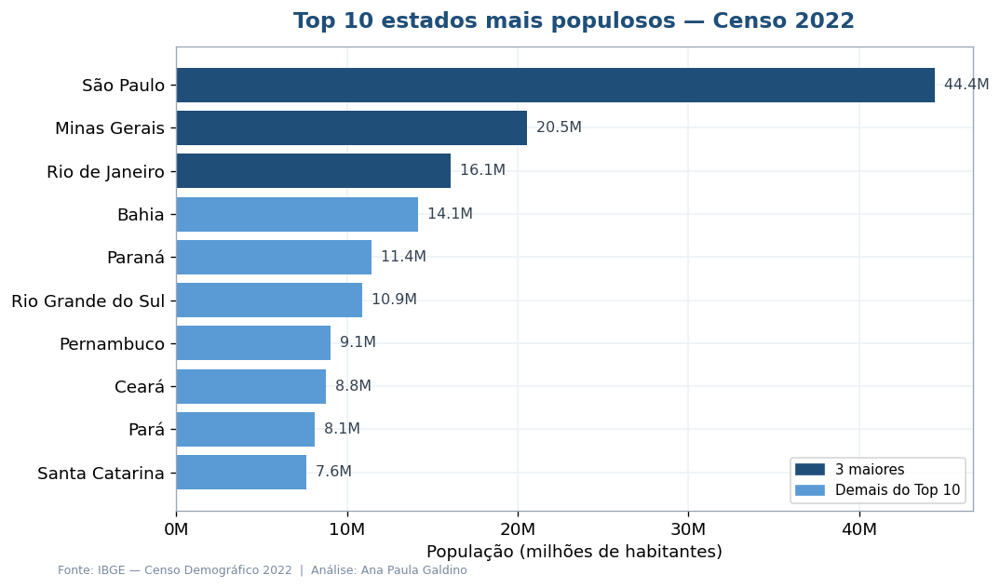
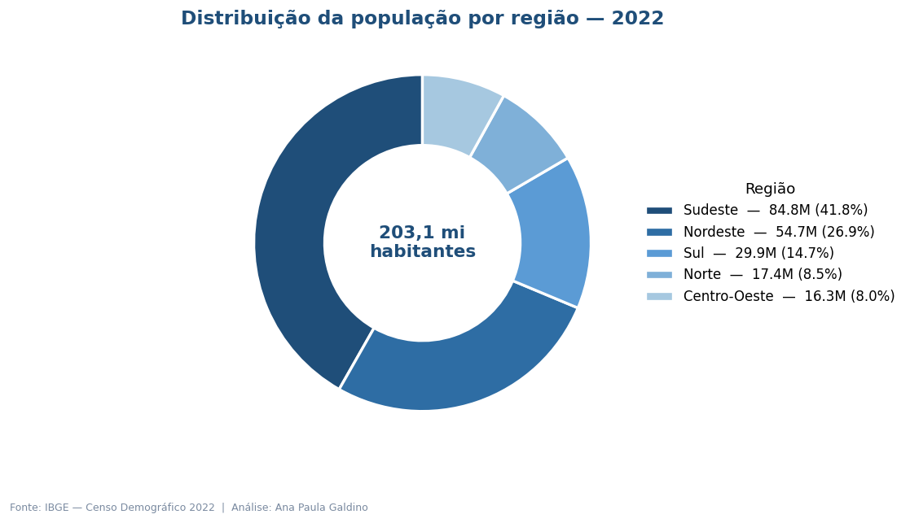
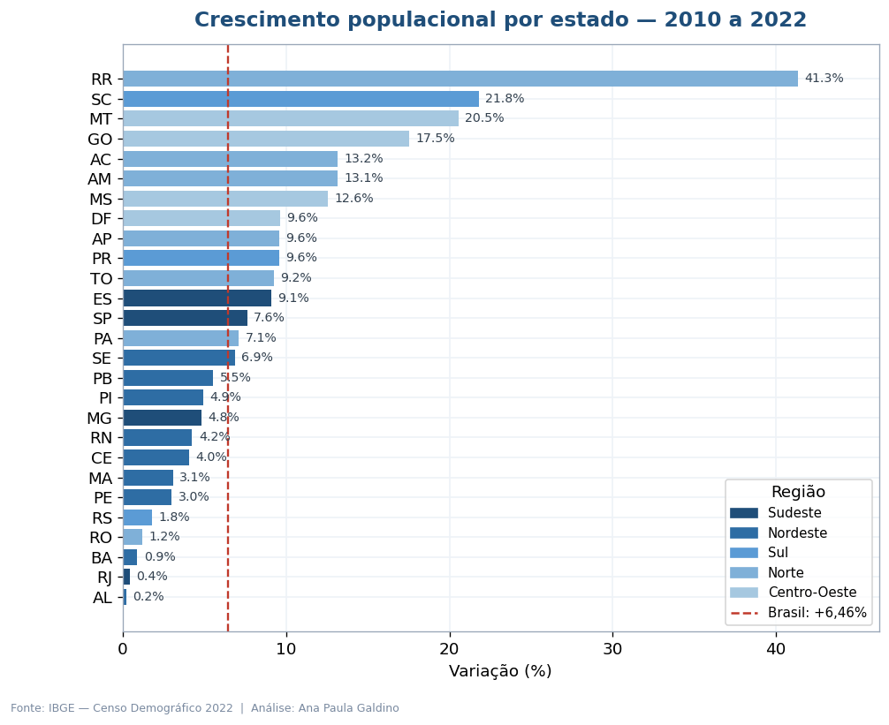
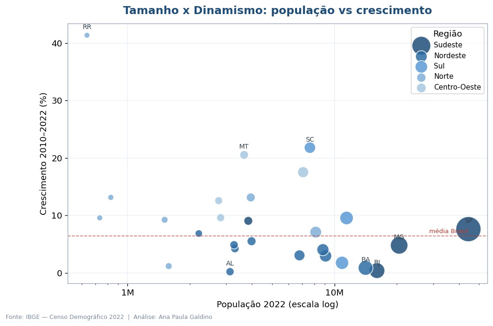
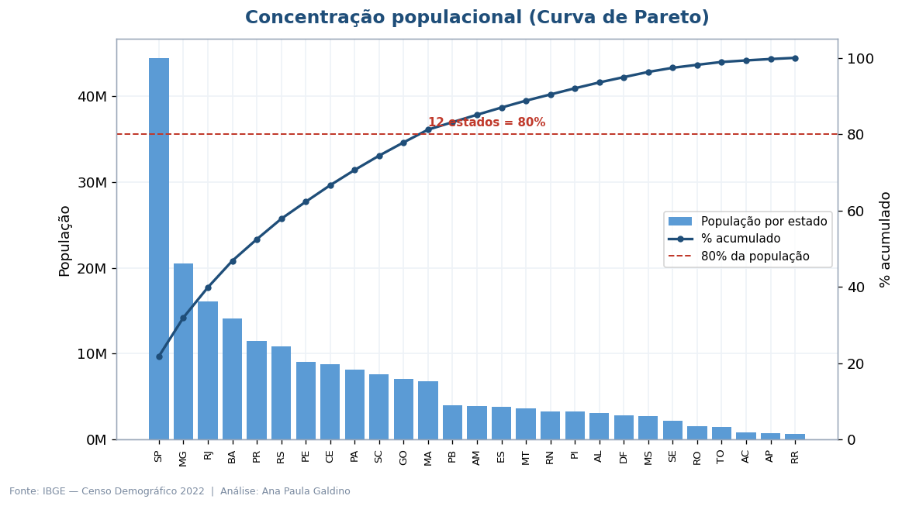
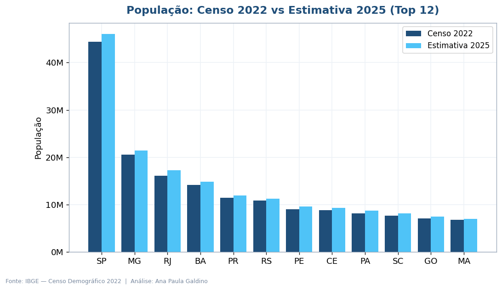

# Indicadores Populacionais do Brasil — Censo IBGE 2022

Peguei os dados oficiais do Censo Demográfico 2022 do IBGE e analisei como a população
das 27 Unidades da Federação se distribui, cresce e se concentra pelo país. O resultado
são 6 visualizações, um dashboard interativo e um relatório executivo em PDF.

**[Ver dashboard interativo ao vivo](https://anapaula-galdino.github.io/brasil-indicadores-ibge/)** · **[Ler a análise executiva (PDF)](Analise_Executiva_IBGE.pdf)**

## O que eu quis responder

- Como a população brasileira está distribuída entre estados e regiões?
- Quais estados mais cresceram (e quais ficaram para trás) entre 2010 e 2022?
- Qual o nível de concentração populacional e o que isso diz sobre o mercado?

## O que os dados mostraram

| Indicador | Resultado |
|---|---|
| População total (Censo 2022) | 203.080.756 habitantes |
| Crescimento 2010 a 2022 | +6,46% (o menor ritmo recente entre dois censos) |
| Os 5 maiores estados | concentram 52,5% da população |
| Região mais populosa | Sudeste, com 41,8% |
| 80% da população | está em apenas 12 estados |
| Estado que mais cresceu | Roraima (+41,3%) |
| Estado que menos cresceu | Alagoas (+0,2%) |

Resumindo a leitura: o Brasil é ao mesmo tempo muito concentrado (Sudeste e Nordeste somam
dois terços da população) e em movimento de interiorização, com Centro-Oeste e Norte
crescendo bem acima da média enquanto centros maduros como Rio de Janeiro, Bahia e Alagoas
quase não se mexem.

## As visualizações

| | |
|---|---|
|  |  |
|  |  |
|  |  |

O dashboard (`docs/index.html`) junta ranking por estado, participação regional, um treemap
região › estado e o gráfico população × crescimento, tudo com tooltips.

## Tecnologias

Python 3.10+, pandas, matplotlib, plotly e reportlab (para o PDF).

## Organização do repositório

```
brasil-indicadores-ibge/
├── README.md
├── Analise_Executiva_IBGE.pdf
├── requirements.txt
├── dados/indicadores_brasil_2022.csv
├── src/
│   ├── analise_ibge.py        # gera os 6 gráficos e o dashboard
│   └── gerar_relatorio.py     # monta o PDF
├── imagens/                   # os 6 gráficos
└── docs/index.html            # dashboard publicado via GitHub Pages
```

## Rodando o projeto

```bash
pip install -r requirements.txt
python src/analise_ibge.py      # gráficos + dashboard
python src/gerar_relatorio.py   # relatório em PDF
```

## De onde vêm os dados

IBGE — Censo Demográfico 2022 (data de referência 01/08/2022), com a estimativa
populacional de 2025 e a variação entre os censos de 2010 e 2022. Tudo público, disponível
no [SIDRA/IBGE](https://sidra.ibge.gov.br) e no [portal do Censo 2022](https://censo2022.ibge.gov.br).

---

Feito por **Ana Paula Galdino** — em formação na pós de Data Analytics da POSTECH/FIAP.
[github.com/AnaPaula-Galdino](https://github.com/AnaPaula-Galdino) · [linkedin.com/in/galdinoana](https://linkedin.com/in/galdinoana/)
